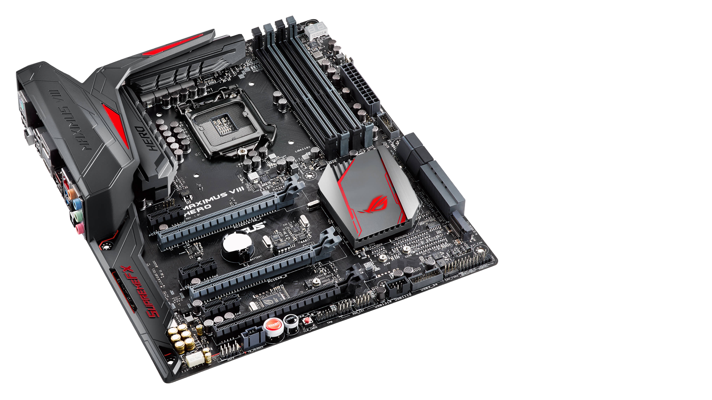

# Hackintosh Guide for **ASUS MAXIMUS VIII HERO Z170 Motherboard**

**This guide it will be updated ASAP.**



## Specs:
| Component | Name |
|:--- |:---:|
| Motherboard:  | ASUS MAXIMUS VIII HERO Z170 |
| CPU: | Intel Core i7-6700K |
| RAM: | G Skill F4-2400MHz C15 4GB x2 |
| iGPU: | Intel HD Graphics 530 |
| dGPU: | GIGABYTE GTX 1070 G1 Gaming |
| NVMe: | Samsung 970 EVO Plus |
| SSD: | KINGSTON SV300S37A240G |
| SSD: | WD WD10EZRZ-00HTKB0 |
| Power Supply: | Nox Hummer 850W |
| Audio: | RealTek ALC1150 |
| Ethernet: | Intel I219-V |
| Case: | Aerocool RIFT RGB |

These are all the external ports of the Motherboard. (**They all work**):


### Working
- [x] **Tested with macOS Big Sur 11.4**
- [x] **Audio:** Realtek ALC1150 (Thanks to AppleALC.kext with layout-id=1 setted in Device Properties)
- [x] **USB:** All internal and external ports (Thanks to SSDT-EC-USBX.aml)
- [x] **Ethernet:** Intel I219-V (Thanks to IntelMausi.kext)
- [x] **HDMI:** Works perfect. 
- [x] **HDMI, DisplayPort:** Works perfect. 
- [x] **Shutdown/Restart/Sleep/Wake:** Yes

### Not working
- dGPU (Any support in Mojave and up).
- Booting with dGPU plugged
- Continuity Features


```bash
```

# INSTALLATION GUIDE

---

## Making the Booteable USB

### From macOS:
[**Link to Apple's Guide**](https://support.apple.com/en-us/HT201372)

**Download installers:** [Monterrey Beta 2](http://swcdn.apple.com/content/downloads/54/23/071-59953-A_U9D4NB05NR/nqzt71pnylsuux326a4vqexb33oz0auhas/InstallAssistant.pkg)(Execute de .pkg to extract the installer) - [Big Sur](https://itunes.apple.com/us/app/macos-big-sur/id1526878132) - [Catalina](https://itunes.apple.com/us/app/macos-catalina/id1466841314) - [Mojave](https://itunes.apple.com/us/app/macos-mojave/id1398502828) - [High Sierra](https://itunes.apple.com/us/app/macos-high-sierra/id1246284741)

1. Connect a >=16 GB pendrive.
2. Open *Disk Utility* and Erase the USB with the name: *MyVolume*.
3. Open *Terminal* and use the proper commands for your macOS installer:
- Monterrey: `sudo /Applications/Install\ macOS\ 12\ Beta.app/Contents/Resources/createinstallmedia --volume /Volumes/MyVolume`
- Big Sur: `sudo /Applications/Install\ macOS\ Big\ Sur.app/Contents/Resources/createinstallmedia --volume /Volumes/MyVolume`
- Catalina: `sudo /Applications/Install\ macOS\ Catalina.app/Contents/Resources/createinstallmedia --volume /Volumes/MyVolume`
- Mojave: `sudo /Applications/Install\ macOS\ Mojave.app/Contents/Resources/createinstallmedia --volume /Volumes/MyVolume`
- High Sierra: `sudo /Applications/Install\ macOS\ High\ Sierra.app/Contents/Resources/createinstallmedia --volume /Volumes/MyVolume`


### From Windows:

[**Link to Dortania's Guide**](https://dortania.github.io/OpenCore-Install-Guide/installer-guide/winblows-install.html)

### From Linux:

[**Link to Dortania's Guide**](https://dortania.github.io/OpenCore-Install-Guide/installer-guide/linux-install.html)


---

# BIOS Settings:
- Make Sure you have [Latest BIOS](https://www.asus.com/us/Motherboards-Components/Motherboards/All-series/MAXIMUS-VIII-HERO/HelpDesk_BIOS/)
- After Updating the BIOS, you need some configuration to working.

---

# OpenCore Configuration

## [Here it's my config.plist and the explanation:](Docs/config.plist.md)
#### [ACPI](Docs/config.plist.md#acpi)
#### [Booter](Docs/config.plist.md#booter)
#### [DeviceProperties](Docs/config.plist.md#deviceproperties)
#### [Kernel](Docs/config.plist.md#kernel)
#### [Misc](Docs/config.plist.md#misc)
#### [NVRAM](Docs/config.plist.md#nvram)
#### [PlatformInfo](Docs/config.plist.md#platforminfo)
#### [UEFI](Docs/config.plist.md#uefi)

---

# Credits

[Apple](https://apple.com) (macOS)

[OpenCore Team](https://github.com/acidanthera/OpenCorePkg) (Bootloader)

[Dortania](https://dortania.github.io/OpenCore-Install-Guide/config-laptop.plist/amd.html#starting-point) (Guide)
